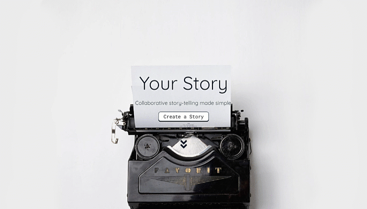
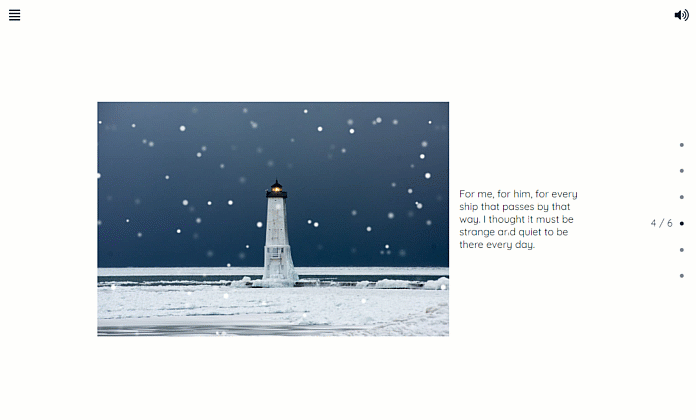
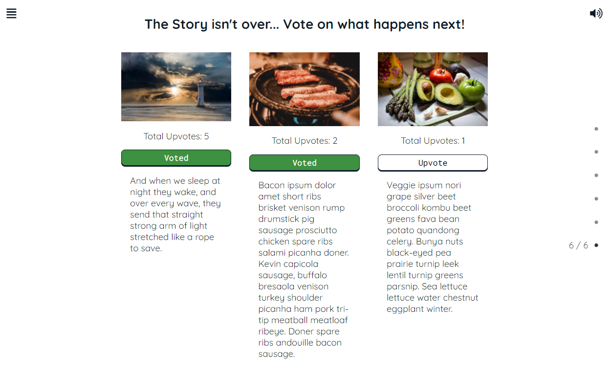
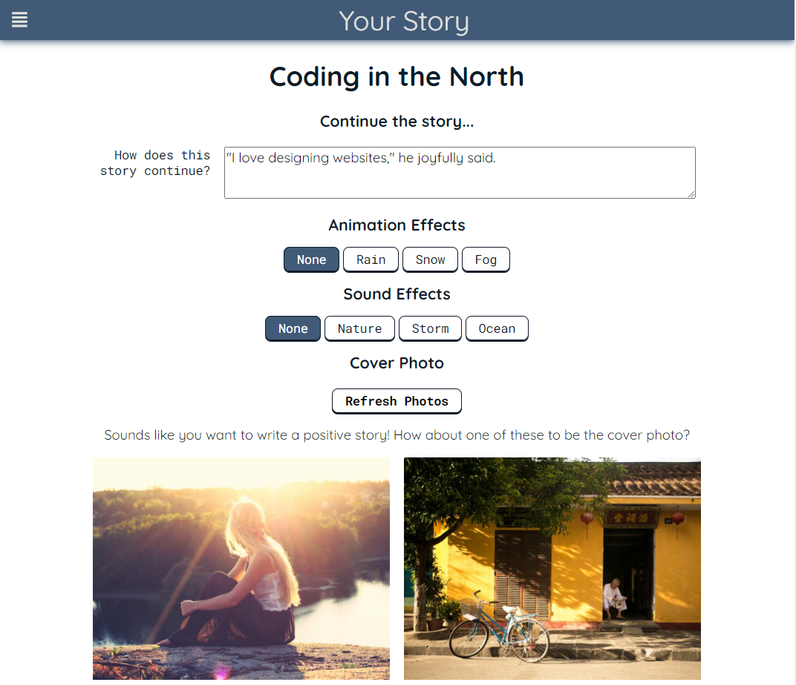

# Your Story

## About
Your Story facilitates collaborative story-telling through an online medium. Users create the first entry to a story and others can contribute to it by suggesting how the story should continue, or by upvoting other contributions.

Your Story is designed to focus on the narrative process. Each story entry combines text with images and various audio and visual effects. The application also includes sentiment analysis, ran on each story entry to suggest suitable photos to pair.

## Screenshots

## Dependencies

- Node 10.x or above
- NPM 5.x or above
- PG 8.x
- Sentiment 5.x

## Authors
Your Story was built by Andrew Han and Ryan Kang as a group project while undertaking the Lighthouse Labs Coding Bootcamp.
